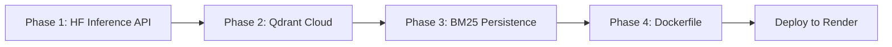

# Deployment & Scaling Implementation Plan

## Current State vs Target State

| Component | Current (Dev) | Target (Production) |
|---|---|---|
| Embeddings | Local model download (~1.5GB RAM) | HuggingFace Inference API (zero RAM cost) |
| Vector DB | Qdrant `:memory:` (lost on restart) | Qdrant Cloud Free Tier (1GB, 1M vectors) |
| BM25 Index | In-memory (lost on restart) | Persisted to SQLite |
| Deployment | Local `uvicorn` | Render.com (free tier) |
| LLM | Groq API | Groq API (unchanged) |

---

## Phase 1: Switch Embeddings to HuggingFace Inference API

**Why:** The current setup downloads and runs `BAAI/bge-large-en-v1.5` (~1.5GB) locally. On a free cloud server, this exhausts memory and RAM limits immediately. The HuggingFace Inference API runs the same model on HF servers — you just call their API.

**Changes Required:**

### 1.1 Update `backend/vectorstore/embeddings.py`
```python
# BEFORE (local model)
from langchain_huggingface import HuggingFaceEmbeddings
return HuggingFaceEmbeddings(model_name=settings.embedding_model_name)

# AFTER (API call)
from langchain_huggingface import HuggingFaceEndpointEmbeddings
return HuggingFaceEndpointEmbeddings(
    model=f"https://api-inference.huggingface.co/pipeline/feature-extraction/{settings.embedding_model_name}",
    huggingfacehub_api_token=settings.hf_token,
)
```

### 1.2 Add to `backend/config.py`
```python
hf_token: str = ""  # HuggingFace API token
```

### 1.3 Add to `.env`
```
HF_TOKEN=hf_your_token_here
```

> [!NOTE]
> Get your free HF token at: https://huggingface.co/settings/tokens
> The free tier allows ~30K requests/month. Sufficient for dev/small production.

### 1.4 Update `requirements.txt`
Remove: `sentence-transformers` (no longer loading locally)
Keep: `langchain-huggingface` (handles both local and API modes)

---

## Phase 2: Qdrant Cloud (Free Persistent Vector DB)

**Why:** The current `:memory:` Qdrant instance is wiped every time the server restarts. On cloud deployments, servers restart frequently.

**Free Tier:** Qdrant Cloud gives you **1 cluster free forever** with 1GB RAM and 1M vectors — more than enough for this project.

### 2.1 Setup
1. Sign up at [cloud.qdrant.io](https://cloud.qdrant.io) (free, no credit card)
2. Create a cluster → Select "Free" plan → Pick a region
3. Copy your **Cluster URL** and **API Key** from the dashboard

### 2.2 Update `.env`
```
QDRANT_URL=https://your-cluster-id.us-east4-0.gcp.cloud.qdrant.io
QDRANT_API_KEY=your_qdrant_api_key
```

### 2.3 Update `backend/config.py`
```python
qdrant_url: str = ":memory:"  # Override with cloud URL in production
```

> [!IMPORTANT]
> No code changes needed in `qdrant_store.py` — it already supports both `:memory:` (dev) and a real URL (prod) based on the `qdrant_url` config value.

---

## Phase 3: Persist BM25 Index (SQLite)

**Why:** BM25 is currently rebuilt on every upload and lost on restart. We need to persist the raw chunks so BM25 can be rebuilt on server startup.

### 3.1 Create `backend/storage/chunk_store.py`
```python
import sqlite3, json

DB_PATH = "chunks.db"

def save_chunks(chunks: list[str]):
    """Persist chunks to SQLite."""
    con = sqlite3.connect(DB_PATH)
    con.execute("CREATE TABLE IF NOT EXISTS chunks (id INTEGER PRIMARY KEY, text TEXT)")
    con.execute("DELETE FROM chunks")  # Clear old data
    con.executemany("INSERT INTO chunks (text) VALUES (?)", [(c,) for c in chunks])
    con.commit()
    con.close()

def load_chunks() -> list[str]:
    """Load persisted chunks from SQLite."""
    try:
        con = sqlite3.connect(DB_PATH)
        rows = con.execute("SELECT text FROM chunks ORDER BY id").fetchall()
        con.close()
        return [r[0] for r in rows]
    except Exception:
        return []
```

### 3.2 Update `backend/main.py` — startup event
```python
@app.on_event("startup")
async def startup_event():
    """On server restart, reload BM25 from persisted chunks."""
    chunks = load_chunks()
    if chunks:
        retrieve_module.global_bm25 = build_bm25_retriever(chunks)
        print(f"Restored BM25 index with {len(chunks)} chunks from storage.")
```

---

## Phase 4: Deploy on Render (Free Tier)

**Why Render:** 750 free hours/month, supports Python/FastAPI, environment variables, persistent disk (optional).

> [!WARNING]
> Render free tier **spins down after 15 minutes of inactivity** and takes ~30 seconds to spin up again. For production, upgrade to the $7/month plan. For a demo/portfolio, free is fine.

### 4.1 Create `Dockerfile` (in project root)
```dockerfile
FROM python:3.11-slim

WORKDIR /app
COPY backend/requirements.txt .
RUN pip install --no-cache-dir -r requirements.txt

COPY . .

EXPOSE 8000
CMD ["uvicorn", "backend.main:app", "--host", "0.0.0.0", "--port", "8000"]
```

### 4.2 Create `render.yaml` (in project root)
```yaml
services:
  - type: web
    name: rag-chatbot-api
    runtime: docker
    plan: free
    envVars:
      - key: GROQ_API_KEY
        sync: false   # Set manually in Render dashboard
      - key: HF_TOKEN
        sync: false
      - key: QDRANT_URL
        sync: false
      - key: QDRANT_API_KEY
        sync: false
```

### 4.3 Deployment Steps
1. Push your code to a GitHub repository
2. Go to [render.com](https://render.com) → New → Web Service
3. Connect your GitHub repo
4. Render auto-detects the Dockerfile
5. Add environment variables in the Render dashboard
6. Click **Deploy**

---

## Phase 5: Environment Config Matrix

Create two `.env` files:

**`backend/.env` (Local Dev)**
```env
GROQ_API_KEY=gsk_...
HF_TOKEN=hf_...
QDRANT_URL=:memory:
EMBEDDING_MODEL_NAME=BAAI/bge-large-en-v1.5
```

**Render Environment Variables (Production)**
```env
GROQ_API_KEY=gsk_...
HF_TOKEN=hf_...
QDRANT_URL=https://your-cluster.cloud.qdrant.io
QDRANT_API_KEY=your_key
EMBEDDING_MODEL_NAME=BAAI/bge-large-en-v1.5
```

---

## Implementation Order



1. **Phase 1** — Switch embeddings (15 min)
2. **Phase 2** — Qdrant Cloud setup (10 min — just env vars)
3. **Phase 3** — SQLite persistence (30 min code)
4. **Phase 4** — Dockerfile + render.yaml (15 min)
5. **Deploy** — Push to GitHub + connect Render (10 min)

**Total estimated time: ~80 minutes**

---

## Free Tier Limits Summary

| Service | Free Limit | Sufficient For |
|---|---|---|
| **Groq** | 1K req/day, 100K tokens/day | Small to medium usage |
| **HuggingFace API** | ~30K inferences/month | Embedding calls |
| **Qdrant Cloud** | 1GB RAM, 1M vectors | ~500K document chunks |
| **Render** | 750 hrs/month, spins down | Portfolio / demo |

---

## Next Steps

Reply with which phase you want to start implementing, and I'll write the code immediately.
